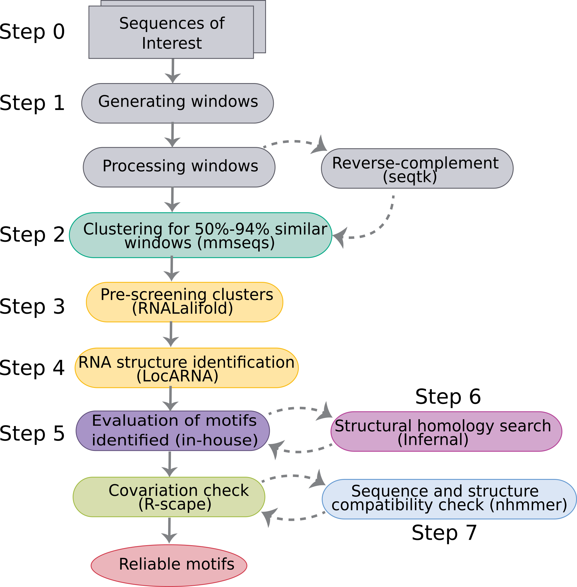

#Pipeline to predict conserved RNA structures in genomes or sequences of interest.

The pipeline is in 6-7 steps starting from input of sequences. This can either be entire genomes or sequences of choice (eg. UTR regions, RNAs from transcriptomes). Please make sure the sequences are in the DNA format (no 'U'), if starting from step 0. 

Figure 1: Overview of the pipeline. Each of the box are color-coded and marked to help identify the steps to be followed. Each of the steps are dispensable depending on which step user wishes to perform. Scripts and tools relevant to each step are in the respective directories.

### For the entire pipeline, following containers and environments files will be easy to use.

1. rnatools Docker file -  easy access to tools like Vienna RNA package, LocARNA, R-scape and HMMER. It can be taken from [dockerhub.](https://hub.docker.com/) and use the following commands to get the container. 
 You can use either docker or singularity [Recommended] to pull the image:

        docker pull dollycm/rnatools:v2
        
     OR

        singularity pull docker://dollycm/rnatools:v2

2. mmseqs2 YAML - for clustering of sequences. YAML file is provided in the respective Step2 clustering folder

3. seqtk YAML - for basic sequence manipulations, including reverse complement input sequences.

StepMisc folder contains miscellaneous steps to use the motifs for analyses in obtaining phylogenetic spread and gene context.