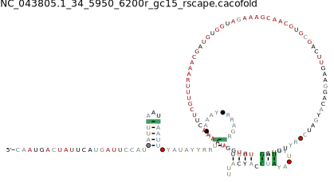

# This step is performed after initial motifs are identified to find RNA homologs likely to adopt the same structure.

Here, the initial alignments (motif_cleaned.sto - ranked High or Mid) are tested if the alignments are capable of finding itself and other RNA structure homologs. This is because each alignment can act as a seed to find more of its kind (family). If it is capable of finding itself and others, than the alignment is reliable and can be added with new homologs to increase the reliability of the seeds (improving the seeds/ models). If seeds fail to find other homologs or themselves, than the seeds are not reliable, therefore making the motif unreliable.

**! Disclaimer:** From this step onwards, we perform the steps iteratively including Step 5 to obtain clean and reliable alignment, search models and homologs.  

We perform this step using [Infernal v1.1.4](http://eddylab.org/infernal/), [R-scape](https://github.com/EddyRivasLab/R-scape), [custom reformatting scripts](https://barricklab.org/twiki/bin/view/Lab/SupplementRiboswitchPrediction_v1) and in-house RNA-SCoRE tools. Infernal, R-scape and custom reformatting scripts are part of the Docker container.

**i. _Build model from alignment_**
Use cmbuild command from Infernal, which helps build covariation model from input stockholm alignment (eg: alignment obtained from Step5 - motif_cleaned.sto). Script 'cmbuild_command.sh' to build the models. For each alignment a .cm file will be obtained. This .cm is calibrated further to optimize the model's threshold to report on homologs using cmcalibrate command (also implemented in the same script).

**ii. _Search for homologs_**
Calibrated model is used to search in genomes/ sequences of interest. The sequences/ genomes used as search space (database) should be combined in 1 multi-fasta file. Use the script 'cmsearch_command.sh' as a guide to execute this search. The output will be a .txt file (output similar to BLAST output format). From this output, extract the required information such as the co-ordinates of the hits, scores of the hits, sequences of the hits and alignment of the hits mapped with secondary structure. This reformatting is done using the script 'reformat_cmalign_job.sh'. Output files such as scores (.tab), fasta (.fna), stockholm (.sto) and colored alignment view (.html) will be obtained which can be used further.

**iii. _Evaluation of homolog alignment_**
Follow Step 5.ii (evaluate the alignment) with parameters adjusted according to the requirement. Scripts are in the corresponding folder and not present in the current folder to avoid redundant files. Manually check if the sequences in the seed alignment are recovered as homolog and has passed evaluation. Since the seed has the sequence, it should also be one of the top-scoring hit (check scores.tab file). Motifs that are ranked 'High' or 'Mid' are considered further.

**iv. _Select Alignments with covariation_**
Follow step 5.iii to obtain information about covariation in the motif. One of the output file generated by R-scape with an extension '.power' informs on the observed covariation and an expected covariation. Thus, we can calculate the percentage of covariation observed for the motif. Use the script 'get_covaryBp_info_automate_gc15.sh' to obtain percentage covariation for the motif written to output file 'rscape_gc15_twoTest_covariation_results.txt'. Motifs with minimum 5% covariation are taken further.

Additionally, R-scape with _--cacofold_ option can provide an additional check on whether the sequences (independent of the thermodynamic-based folding) still adopts the same structure. It outputs RNA structure drawing (examples below) and can be compared with locARNA predicted structure. In our studies, such comparison is done visually. 
 
**RNA structure does not change**  
|  |  |
|-------------------------------------------------|-----------------------------------------------------|

In the above example, both the structures are identical, suggesting the sequences in the alignment form the structure as predicted by locARNA and it is less likely random.

**RNA structure is similar**   
|  |  |
|-------------------------------------------------|-----------------------------------------------------|

In the example, above, the locarna predicted structure on the left and cacofold predicted structure on right are highly similar with very few differences such as the 3rd stem does not have bulges in cacofold structure and reduces the loop to 1nt. User can make the choice if the cacofold structure shows improvement over locARNA predcited structure (eg: found an extra stem-loop in additon to locARNA predicted structure), use the .cacofold.sto as the alignment to go forward with. Incase there is less improvement, like in this case (1nt loop in third stem-loop is intuitively not acceptable and hence, locARNA predicted structure and its corresponding alignment (motif_cleaned.sto) will be considered).

**RNA structure is very different**
|  |  |
|-------------------------------------------------|-----------------------------------------------------|

In the above example, the structure predicted by LocARNA, one of the stems which is highly identical among sequences, do not form base-pair in the cacofold predicted structure. Instead it creates a big bulge in the last stem which is biologically less likely to occur. It thus makes it difficult, which conformation to choose and thus such motif is considered weak and discarded from taking it further.  

Such evaluation is performed on motifs individually and decided manually which motifs are to be taken further.
